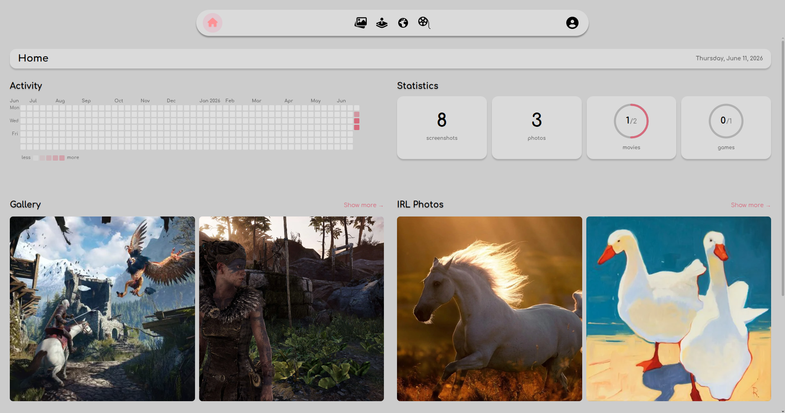
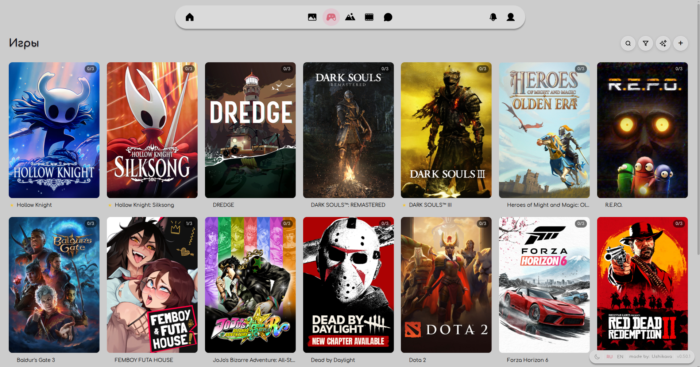
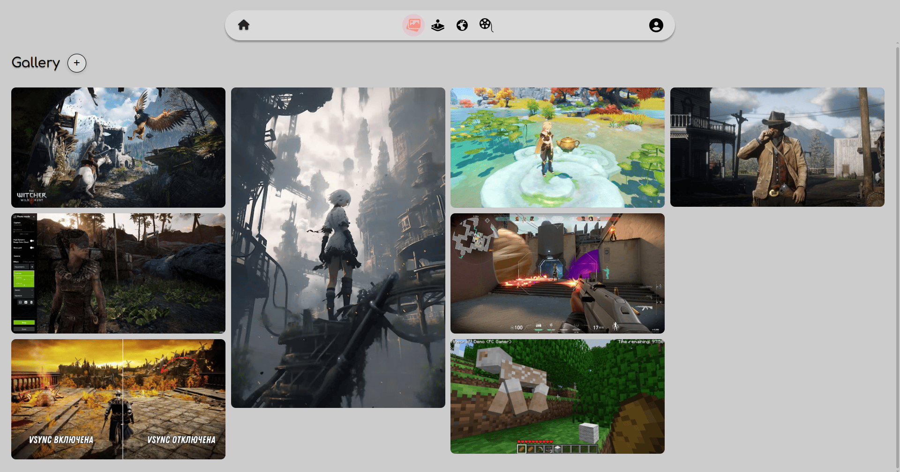

# 🥳 Friends Activity Site 🫂

A personal website for a small group of friends: photo gallery, favorite places, movies and games tracker, wishlist and activity feed.

<p align="center">
  
</p>

---

## Screenshots

<p align="center">
  
</p>

<p align="center">
  
</p>

<p align="center">
  
</p>

---

## Stack

**Backend:** Python · FastAPI · SQLAlchemy · Alembic · PostgreSQL · JWT  
**Frontend:** React 19 · TypeScript · Vite · React Router

## Features

- Photo gallery and IRL places with lightbox viewer
- Movies & games tracker with watched/played status per user
- Wishlist per user - add items with title, URL, price; view others' wishlists
- Activity feed with per-user filter
- User profiles with avatar upload (crop / zoom before saving)
- Activity heatmap
- Mini-statistics dashboard
- AI chat assistant
- Simple role-based access without registration
- User management - add, delete users, delete own account
- Dark / light theme toggle
- Pagination on all listing pages
- Russian / English interface

## Project Structure

```
friends-activity/
├── backend/
│   └── app/
│       ├── main.py          # FastAPI entry point
│       ├── core/            # config, auth, exceptions
│       ├── api/             # routers
│       ├── db/              # models and CRUD
│       ├── schemas/         # Pydantic schemas
│       ├── utils/           # helpers
│       └── alembic/         # database migrations
├── frontend/
│   └── src/
│       ├── pages/           # application pages
│       ├── components/      # reusable components
│       ├── api/             # backend client
│       └── i18n/            # translations (ru / en)
└── .env.template
```

## Getting Started

### Requirements

- Python 3.12+
- Node.js 20+
- PostgreSQL

### Backend

```bash
cd backend/app
python -m venv venv
source venv/bin/activate
pip install -r ../requirements.txt

cp ../../.env.template .env

alembic upgrade head
uvicorn main:app --reload
```

### Frontend

```bash
cd frontend
cp ../.env.template .env

npm install
npm run dev
```

## Environment Variables

Use `.env.template` as a reference. Two files are required:

| File | Variables |
|------|-----------|
| `backend/app/.env` | `DATABASE_URL`, `SECRET_KEY`, `ACCESS_TOKEN_EXPIRE_MINUTES`, `CORS_ORIGINS` |
| `frontend/.env` | `VITE_API_URL`, `VITE_UPLOADS_URL` |

## Migrations

```bash
cd backend/app
alembic upgrade head                                   # apply all migrations
alembic revision --autogenerate -m "description"
```

## Deployment

Nginx is used as a reverse proxy in production.

```bash
# frontend
cd frontend && npm run build

# backend
cd backend/app
uvicorn main:app --host 0.0.0.0 --port 8000
```

## Credits

- Author of this version - [Ushikava](https://github.com/Ushikava)
- Original idea and concept - [luluoliv/lovepage](https://github.com/luluoliv/lovepage)
- UI design - [LovingDevs 2.0](https://www.figma.com/design/ORTGCVBP53r8833r17wLKp/LovingDevs-2.0?node-id=17-6&t=51jnchLJUcCKYWXi-0) on Figma
